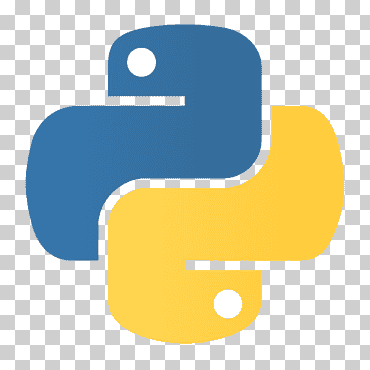

### Hi, I´m Pau!👋

I am a Sports Analytics enthusiast and Data Analyst. I am passionate about technologies and I love to lear new things especially anything related to sabermetrics. :baseball:

#### :hammer_and_wrench: My Tech Stack 

#### :envelope: Find me on:

#### :blue_book: I enjoy writing articles:

#### :chart_with_upwards_trend: My Github Stats:

<!--
**pausancho/pausancho** is a ✨ _special_ ✨ repository because its `README.md` (this file) appears on your GitHub profile.

 

Here are some ideas to get you started:

- 🔭 I’m currently working on ...
- 🌱 I’m currently learning ...
- 👯 I’m looking to collaborate on ...
- 🤔 I’m looking for help with ...
- 💬 Ask me about ...
- 📫 How to reach me: ...
- 😄 Pronouns: ...
- ⚡ Fun fact: ...
-->
